# SDP Discovery Libraries

[](https://pkg.go.dev/github.com/overmindtech/discovery) [](https://github.com/overmindtech/discovery/actions/workflows/test.yml)

Code to help with all things related to discovering system state using [State Description Protocol](github.com/overmindtech/sdp). Allows users to easily create software that discovers system state, for example:

* Source containers for running with [srcman](https://github.com/overmindtech/srcman)
* Agents for discovering local state on servers and other devices

This library is currently under development and documentation can be found on [pkg.go.dev](https://pkg.go.dev/github.com/overmindtech/discovery)

## Engine

The engine is responsible for managing all communication over NATS, handling queries, reporting on progress, caching etc. Authors of sources should only need to do the following in order to have a functional source:

* Give the engine a name
  * Note that this name is used as the `Responder` when responding to queries, this means that this name should be unique as if there are multiple responders with the same name, users will not be able to properly track the progress of their queries
* Provide the engine with config
* Manage the engine's lifecycle (start and stop it)

Look at the tests for some simple examples of starting and running an engine, or use the [source-template](https://github.com/overmindtech/source-template) to generate the required wrapper code.

## Triggers

**NOTE:** This was never fully implement and shouldn't be used

Triggers allow source developers to have their source be triggered by the discover of other items on the NATS network. This allows for a pattern where a source is triggered by a relevant resource being discovered by another query, rather than by being queried directly. This can be used to write secondary adapters that fire automatically e.g.

> When a package with the name "nginx" is found in any scope, the source should be triggered to try to find the config file for nginx in this scope, parse it, and return more detailed information.

The anatomy of a trigger is as follows:

```go
var trigger = Trigger{
    // The type of item that this trigger should fire for
    Type:                      "person",
    // The trigger will only fire if both the type and the
    // UniqueAttributeValueRegex match
    UniqueAttributeValueRegex: regexp.MustCompile(`^[Dd]ylan$`),
    // When both of the above match, the below function will be called, this
    // function should return the query that should be forwarded to the
    // engine that the trigger is registered with
    QueryGenerator: func(in *sdp.Item) (*sdp.Query, error) {
        if in.GetScope() != "something" {
            return nil, errors.New("only 'something' scope supported")
        } else {
            return &sdp.Query{
                Type:   "dog",
                Method: sdp.QueryMethod_SEARCH,
                Query:  "pug",
            }, nil
        }
    },
}
```

When the above trigger fires it will result in the engine that it is assigned to processing a SEARCH query as defined above. Note that while only the `Type`, `Method` and `Query` attributes have been specified, the rest will be filled in automatically with data from the `Metadata.SourceQuery` of the originating item to ensure that the responses are sent to the user that originated the query.

## Auth

The engine can authenticate using either an Overmind API Key (e.g. `ovm_...`) or a static OAuth2 Access Token (in form of a JWT). The static token is only used for managed sources currently and shouldn't be used by end-users since you have to manage the expiration and rotation of the token yourself, as well as getting it in the first place.

### API-Key Auth

```mermaid
sequenceDiagram

    alt ApiKeyServiceClient.ExchangeKeyForToken
        Engine->>Overmind: API Key
        Overmind-->>Engine: OAuth Access Token (JWT)
    end

    alt ManagementServiceClient.CreateToken
        Engine->>Engine: Generate NKey Pair
        Engine->>Overmind: OAuth Access Token & Public Nkey & Username
        Overmind-->>Engine: NATS JWT
    end

    Engine->>NATS: NATS JWT
    NATS-->>Engine: Nonce (Some random text)
    Engine->>Engine: Sign Nonce using Private NKey
    Engine->>NATS: Signed Nonce
    NATS-->>Engine: Connected
```



Login to the Overmind app, eg [local dev](https://localhost.df.overmind-demo.com:3000/settings/api-keys) and create a new overmind API key. Use the scope of 'request:receive'. To use the API key with a source add the CLI option

```shell
go run main.go start --aws-regions eu-west-2  --aws-access-strategy sso-profile --aws-profile sso-dogfood --api-key=ovm...
```

### Static Access Token Auth


To generate a static access token go to `https://manage.auth0.com/dashboard/eu/om-dogfood/applications` and select your application. Go to quick start and grab the curl command. You will need to add the account_name to the curl request. eg `,"account_name":"6351cbb7-cb45-481a-99cd-909d04a58512"`. This will return a JWT token that you can use to authenticate with the engine. You can now start your source.

```shell
go run main.go start --aws-regions eu-west-2  --aws-access-strategy sso-profile --aws-profile sso-dogfood --overmind-managed-source true --source-access-token-type Bearer --source-access-token ey....
```

## Default Adapters

### `overmind-source`

This source returns information about other adapters as SDP items. Can be used to inventory what adapters are available.

Methods:

* [x] `Get()`: Returns adapters by their descriptive name
* [x] `List()`
* [ ] `Search()`

### `overmind-scope`

Returns available scopes as SDP items. This is intended to be used to improve UX in the GUI since users will be able to see what scopes are available.

Methods:

* [x] `Get()`: Returns scopes by their name
* [x] `List()`
* [x] `Search()`: Search by any string. Intended to be used by autocomplete in the GUI and therefore places extra weight on prefixes however will also perform free-text and fuzzy matching too

### `overmind-type`

Returns available types as SDP items. This is intended to be used to improve UX in the GUI since users will be able to see what types are available.

Methods:

* [x] `Get()`: Returns scopes by their name
* [x] `List()`
* [x] `Search()`: Search by any string. Intended to be used by autocomplete in the GUI and therefore places extra weight on prefixes however will also perform free-text and fuzzy matching too

## Developing

This repository is configured to us [VSCode devcontainers](https://code.visualstudio.com/docs/remote/containers). This means that if you don't want to install Go locally, you can do all of your development inside a container. You can also use Github code spaces to host these containers meaning that the only requirement is having VSCode installed. Use of this is optional but does have some benefits:

* Local environment not polluted
* NATS sidecar container automatically started for end-to-end tests

### Releasing

- Make sure that main is green before proceeding! Then in the discovery directory, update to latest.

```shell
git fetch --all
git rebase origin/main
```

- Compare the changes from the last release to what is in main. For [example](https://github.com/overmindtech/discovery/compare/v0.29.2...main). Following [semver](https://semver.org/) choose your new version. And use it to tag a version, and push it.

```shell
git tag v0.0.0
git push origin tag v0.0.0
```

- Github actions will then run.

